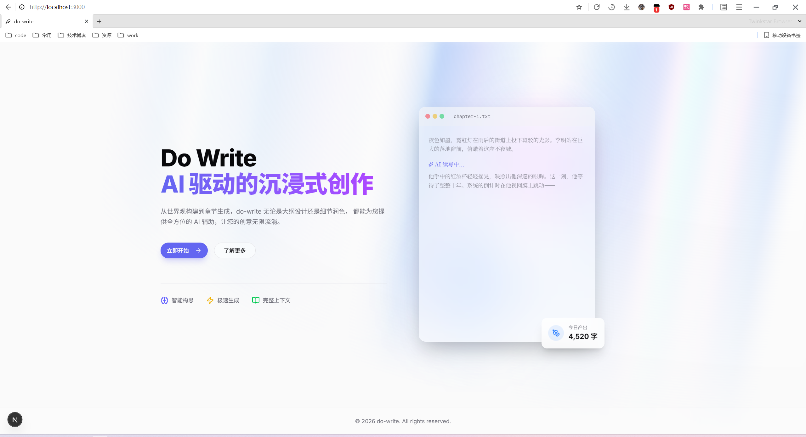
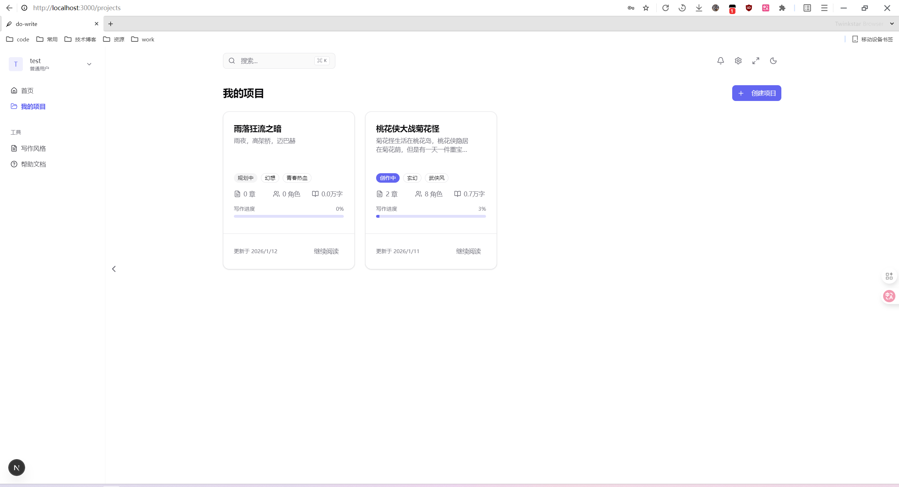
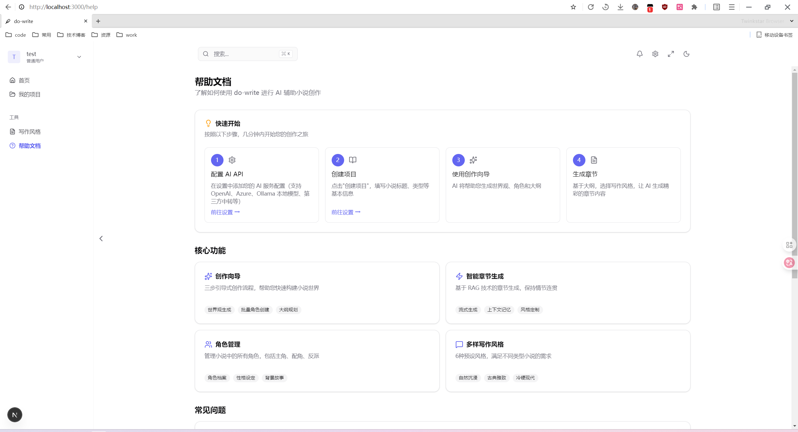

# do-write

耗时一个多月的学习与开发，终于是把自己心中的Java版本的 AI 驱动的小说创作平台给实现了，功能比较简单，通过智能向导引导用户完成世界观构建、角色设计、大纲规划和章节生成的完整创作流程。
非常感谢j佬的思路让我有了灵感去做一版AI相关的东西[MuMuAINovel](https://github.com/xiamuceer-j/MuMuAINovel)
虽然没有他的功能上那么完善，目前这个版本就是我自己比较满意的了，可能下一步完善的部分就是自定义提示词，但可能以修bug为主(比如大纲一对多的功能我就还没测)。

目前部署了一个[演示地址](https://sn0w.icu)可以体验一下，域名还有两个月到期了。


## 特性

- **创作向导**：分步引导完成世界观、角色、大纲的 AI 生成
- **智能章节生成**：基于 RAG（检索增强生成）的上下文感知写作
- **故事记忆**：ChromaDB 向量数据库存储关键情节，保持剧情连贯
- **多模型支持**：OpenAI、Ollama、DashScope（阿里云百炼）以及第三方中转API
- **第三方登录**：Linux.do、FishPi OAuth 接入
- **一键部署**：Docker Compose 全栈部署

## 截图预览

**首页**



**项目页**



**帮助页**



## 技术栈

**后端**
- Spring Boot 3.4.12 + Java 17
- Spring AI 1.1.2（多模型抽象）
- MyBatis-Plus 3.5.15
- sa-token 1.44.0（认证授权）
- MySQL + Redis + ChromaDB

**前端(AI实现, Gemini CLI前端太强了)**
- Next.js 16 + React 19
- TypeScript 5
- Tailwind CSS 4 + Radix UI
- Zustand + React Query

## 快速开始

### 环境要求

- JDK 17+
- Node.js 20+ (pnpm)
- MySQL 8.0+
- Redis 6.0+
- Docker & Docker Compose（生产部署）

### 开发环境

```bash
# 1. 克隆项目
git clone https://github.com/your-username/do-write.git
cd do-write

# 2. 初始化数据库
mysql -u root -p < docs/sql/init.sql

# 3. 配置后端
# 编辑配置文件，填写数据库、Redis、AI API 等配置

# 4. 启动后端

# 5. 启动前端
cd frontend
pnpm install
pnpm dev
```

访问 http://localhost:3000 开始使用。

### Docker 部署

```bash
# 1. 准备环境配置
cp .env.example .env
# 编辑 .env 文件，配置必要的环境变量

# 2. 启动全部服务
docker-compose up -d

# 3. 查看日志
docker-compose logs -f
```

服务端口：
- 前端：3000
- 后端 API：8099
- ChromaDB：8000

## 项目结构

```
do-write/
├── write-common/          # 公共模块（工具类、异常、响应封装）
├── write-server/          # 后端服务
│   ├── config/            # 配置（sa-token、AI、数据源）
│   ├── controller/        # REST API
│   ├── service/           # 业务逻辑
│   ├── ai/                # AI 集成（ChatClient、提示词）
│   ├── entity/            # 数据库实体
│   └── mapper/            # MyBatis 数据访问
├── frontend/              # Next.js 前端
│   ├── app/               # App Router 页面
│   ├── components/        # React 组件
│   └── lib/               # 工具函数、API 客户端
├── docker/                # Docker 构建文件
│   ├── frontend/          # 前端 Dockerfile
│   └── nginx/             # Nginx 配置
└── docs/                  # 详细设计文档
```

## 核心功能

### 创作向导

1. **世界观生成**：AI 根据类型和主题生成时代背景、地理环境、氛围基调、世界规则
2. **角色生成**：批量生成主角、配角、反派和组织，包含外貌、性格、背景故事
3. **大纲生成**：支持一对一（1章=1大纲）或一对多（1大纲展开为多章）模式

### 章节生成

- **上下文构建**：自动整合世界观、角色、大纲、前文
- **RAG 记忆检索**：从 ChromaDB 召回相关历史情节（Top 5）
- **写作风格**：6 种预设风格（简洁明快、细腻描写、悬疑紧张等）
- **流式输出**：SSE 实时推送生成内容

### 故事记忆

- 章节完成后自动提取关键情节
- 向量化存储到 ChromaDB
- 语义相似度搜索，支持智能上下文回忆

## 数据库

系统包含 **10 张表**：

- **用户模块**：`user`、`user_oauth`
- **配置模块**：`user_api_config`（AI API 密钥，AES-256 加密）
- **小说模块**：`novel_project`、`novel_chapter`、`novel_outline`、`novel_character`、`novel_story_memory`、`novel_plot_analysis`、`novel_generation_task`

完整 DDL 见 [docs/sql/init.sql](docs/sql/init.sql)。

## 环境变量

主要配置项（见 `.env.example`）：

```bash
# 数据库
MYSQL_HOST=localhost
MYSQL_DATABASE=do_write
REDIS_HOST=localhost

# AI 服务（至少配置一个）
OPENAI_API_KEY=sk-xxx
OPENAI_BASE_URL=https://api.openai.com
OLLAMA_BASE_URL=http://localhost:11434
DASHSCOPE_API_KEY=sk-xxx

# 加密密钥
AI_ENCRYPTION_KEY=your-32-char-key

# OAuth（可选）
LINUXDO_CLIENT_ID=xxx
LINUXDO_CLIENT_SECRET=xxx
```

## 许可证

[MIT License](LICENSE)

## 致谢

- [MuMuAINovel](https://github.com/xiamuceer-j/MuMuAINovel) - 非常强，我什么时候能这么强
- [LDC](https://github.com/linux-do/credit) - 落地页灵感就是从LDC得来，第一次见的时候真的感觉非常炫酷

## 贡献

欢迎提交 Issue 和 Pull Request！

- 发现 Bug？请提交 [Issue](https://github.com/zhazhahehedian/do-write)
- 有新想法？欢迎 Fork 后提交 PR
- 使用问题？可以在 Issue 中讨论

## 联系

如有问题或建议，欢迎通过以下方式联系：

- qq(1073929206)
- Linux.do([dpbug](https://linux.do/u/dpbug))/fishpi([deeplovebug](https://fishpi.cn/member/deeplovebug))
